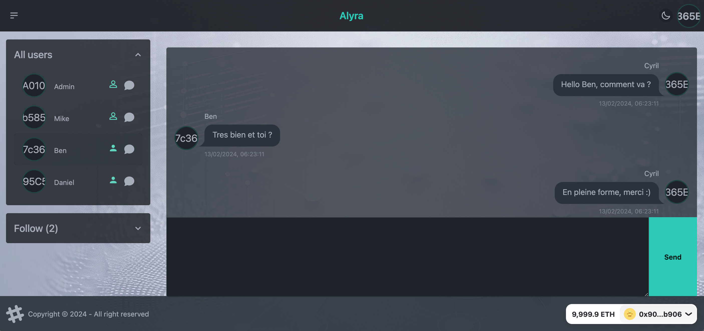

# Decentralized Social Networks Maker (dsnMaker)

[Contract address](https://mumbai.polygonscan.com/address/0x33Ff280D2422D6ac5A11F479650931bAc2F20d33#code)
[Demo](https://dsnmaker.on.fleek.co/)

**dsnMaker**, a comprehensive platform designed to revolutionize social networking through decentralization. This project encapsulates both frontend and backend components, seamlessly integrating to deliver a decentralized social network experience.

## Overview

**dsnMaker** enables users to create, manage, and interact within their own decentralized social networks. It focuses on user autonomy, privacy, and interactive social features, all underpinned by blockchain and ipfs technology.

### Frontend

Explore the frontend details, including setup and deployment instructions, in the [Frontend README](https://github.com/wi2/social/tree/master/social-frontend).

### Backend

For backend functionalities, smart contract interactions, and deployment, refer to the [Backend README](https://github.com/wi2/social/tree/master/social-backend).

### Key Features

- Create and manage user-centric social networks.
- Post articles, follow users, like, pin, and retweet content.
- Exchange messages securely within the network.
- Full decentralization with content stored on IPFS.

### Technology Stack

The project utilizes modern technologies like Next.js, TypeScript, Solidity, and IPFS, hardhat ensuring a robust and efficient user experience.

## Author

Project created and developed by GAETA Michael
