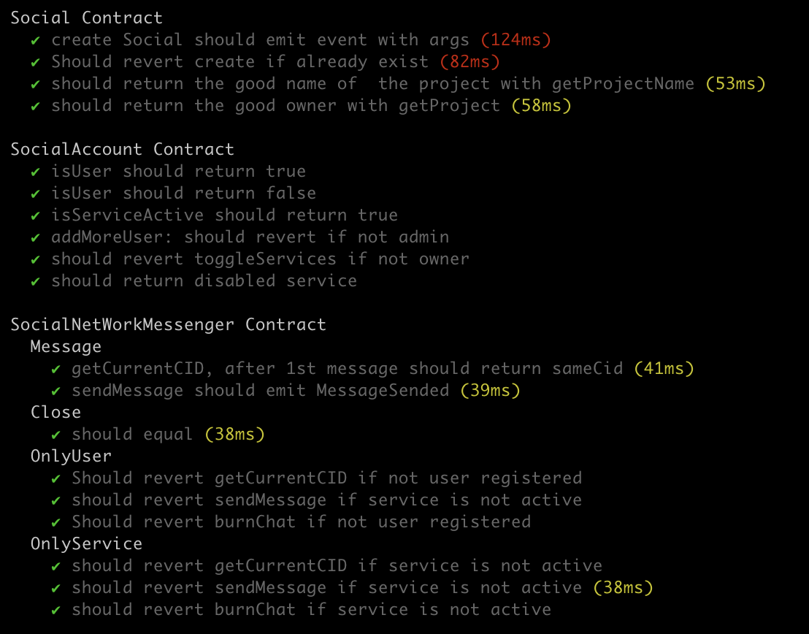

# Decentralized Social Networks Maker (dsnMaker) - Backend

**Decentralized Social Networks Maker (dsnMaker)**, an innovative platform designed to revolutionize the way we think about and interact on social networks. In an era where privacy concerns and centralized control dominate traditional social media, dsnMaker offers a refreshing and empowering alternative. By leveraging the power of blockchain technology, dsnMaker provides a suite of tools for creating and managing decentralized social networks where privacy, user autonomy, and transparent governance are paramount.

## Key Features

- **Factory Contract**: At the heart of dsnMaker lies the Social Factory Contract, a robust mechanism for deploying independent social networks. Each network is a self-contained ecosystem with its core components, ensuring full autonomy and customization.

### User Account Management

- **SocialAccount**: This contract is crucial for managing user accounts within each network. It utilizes advanced cryptographic methods like Merkle Proof for secure user verification, adding a layer of security and trust.

### Modular Functionality

- **Common Functionalities**: The abstract SocialBaseCommon contract provides essential functionalities that other specific feature contracts inherit, ensuring consistency and efficiency across the platform.

### Comprehensive Social Interaction

- **SocialNetWork**: This contract integrates various social networking features such as article posting, likes, follows, and pins, offering a rich and engaging user experience reminiscent of traditional social media but with enhanced privacy and user control.

### Messaging and Communication

- **SocialNetworkMessenger**: Prioritizing secure and private communication, this contract manages encrypted messaging services, fostering seamless interaction within the network.

### User Profile Customization

- **SocialProfile**: Addressing the need for personal expression, this contract allows users to create and manage their profiles, enhancing the social aspect of the network.

---

## Test and coverage





before starting, Add file `./.env`

```
PRIVATE_KEY=[YOUR_WALLET_PRIVATE_KEY]
POLYGONSCAN_API_KEY=[YOUR_POLYGONSCAN_API_KEY]
MUMBAI_RPC_URL=https://...
PINATA=[YOUR_PINATA_JWT]
```

Try running test

```shell
npx hardhat test
REPORT_GAS=true npx hardhat test
npx hardhat node
npx hardhat run scripts/deploy.ts
```

Try running coverage

```shell
npx hardhat test
REPORT_GAS=true npx hardhat test
npx hardhat node
npx hardhat run scripts/deploy.ts
```

---

## Start node and deploy project

Try deploy empty project

```shell
npx hardhat node
npx hardhat run scripts/deploy.ts --network localhost
```

or for mumbai polygon

```shell
npx hardhat run scripts/deploy.ts --network mumbai

```

Try deploy project with script to create a project with multiple article and actions(follow, like,...)

```shell
npx hardhat node
node scripts/pinata.js
npx hardhat run scripts/deployPlus.ts --network localhost
```

or for mumbai polygon

```shell
npx hardhat node
node scripts/pinata.js
npx hardhat run scripts/deployPlus.ts --network mumbai
```

Here are concise descriptions of each smart contract in your decentralized social network, highlighting their functionalities and interrelationships:

---

## Smart contract Details


1. **Social (Factory Contract)**:

   - Function: Acts as a factory to create individual social networks.
   - Features: Each network includes a main account, platform, messenger, and profile.
   - Relationships: Deploys instances of `SocialAccount`, `SocialNetwork`, `SocialNetWorkMessenger`, and `SocialProfile`.

2. **SocialAccount**:

   - Function: Manages user accounts and services within the network.
   - Features: Handles service activations, user verifications (using Merkle Proof), and admin controls.
   - Relationships: Central to various network services like public network access, messaging, and profile management.

3. **SocialBaseCommon (Abstract Contract)**:

   - Function: Provides common functionalities for feature-specific contracts.
   - Features: Includes mechanisms for service activation verification and user authenticity.
   - Relationships: Base contract inherited by feature-specific contracts (e.g., `SocialNetWorkArticle`).

4. **SocialNetWork**:

   - Function: Integrates various social networking features.
   - Features: Combines articles, likes, follows, and pins functionalities.
   - Relationships: Inherits from `SocialBaseCommon` and integrates `SocialNetWorkArticle`, `SocialNetWorkLikes`, `SocialNetWorkFollowers`, `SocialNetWorkPins`.

5. **SocialNetWorkArticle**:

   - Function: Manages article posting and retrieval.
   - Features: Stores the last article posted by each user.
   - Relationships: Designed to be inherited by `SocialNetWork`.

6. **SocialNetWorkComment**:

   - Function: Manages comments adding and retrieval.
   - Features: Stores the last comment added for a cid article.
   - Relationships: Designed to be inherited by `SocialNetWork`.

7. **SocialNetWorkFollowers**:

   - Function: Manages follower relationships between users.
   - Features: Enables users to follow or unfollow others, with custom checks for already followed/unfollowed statuses.
   - Relationships: Intended to be part of `SocialNetWork`.

8. **SocialNetWorkLikes**:

   - Function: Handles liking and unliking articles.
   - Features: Tracks like status and count for each article.
   - Relationships: Part of the `SocialNetWork` contract.

9. **SocialNetworkMessenger**:

   - Function: Manages messaging services within the network.
   - Features: Handles chat sessions, message encryption, and chat history.
   - Relationships: Extends `SocialBaseCommon`, connected to `SocialAccount`.

10. **SocialNetWorkPins**:

- Function: Provides functionality for pinning and unpinning articles.
- Features: Allows users to mark articles as pinned for easy access.
- Relationships: Part of the functionalities within `SocialNetWork`.

11. **SocialProfile**:

- Function: Manages user profiles within the network.
- Features: Handles operations like profile creation and updates (pseudo, status).
- Relationships: Extends `SocialBaseCommon` and connected to `SocialAccount`.

## Techno

- Hardhat
- Ether
- Solidity
- Openzeppelin
- Typescript

## Author

Project created and developed by GAETA Michael
